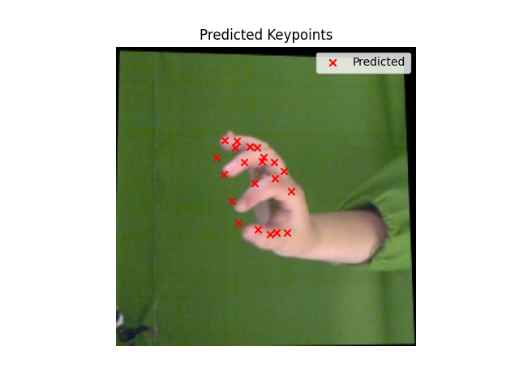
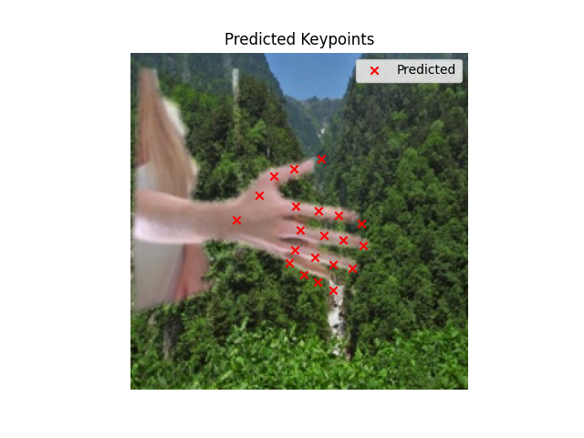

# EchoNet2D

<p align="center">
  
</p>

**EchoNet2D** is a PyTorch-based deep learning model designed for 2D hand keypoint detection from RGB images. It is trained primarily on the FreiHAND dataset and aims to provide accurate and efficient hand landmark localization suitable for research, prototyping, and integration into hand-tracking applications.

---

## Features

- Lightweight neural network for 21 hand keypoints  
- Trained on publicly available FreiHAND dataset with 128x128 input resolution  
- Includes data loading, training, evaluation, and visualization scripts, and a pretrained model
- Simple Tkinter-based GUI for quick inference and visualization on new images  
- Modular code structure for easy customization and extension

---

## Getting Started

### Requirements

- Python 3.8+  
- PyTorch  
- torchvision  
- numpy  
- matplotlib  
- Pillow  
- tqdm  

See `requirements.txt` for the full list.

---

## 📦 Pretrained Model

⚠️ **Note**: The trained model file (`echo_model.pth`) is **not included** in this repository due to size limits, though `TrainEchonet.py` does automatically create the `.pth` file.

To run:
- You must train the model yourself using the FreiHAND dataset

➡️ After obtaining the model file, place it in the root project directory or update the path in `UseModel.py` accordingly.

---

## Demo

Below is a sample (`UseModel.py`) prediction output:
<p align="center">
  
  
  
</p>

---
### Installation

Clone the repository:

```bash
git clone https://github.com/yourusername/EchoNet2D.git
cd EchoNet2D
pip install -r requirements.txt
```
---

## Acknowledgments

This project uses the FreiHAND dataset created by Zimmermann et al.  
Please refer to the [FreiHAND dataset page](https://lmb.informatik.uni-freiburg.de/resources/datasets/FreiHAND.en.html) for more information.  
We gratefully acknowledge the original authors for making this dataset publicly available.
