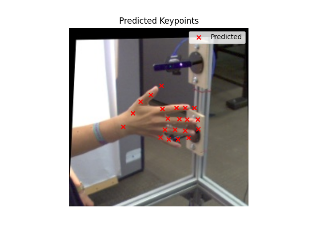

# EchoNet2D

<p align="center">
  
</p>

**EchoNet2D** is a PyTorch-based framework for training and evaluating a CNN model for 2D hand keypoint detection from RGB images. Designed around the FreiHAND dataset, it enables accurate landmark localization through a customizable training pipeline.

> **Note:** Pretrained model weights are **not included** due to file size limits. Please train the model using the provided scripts.

---

## ✨ Features

- Lightweight neural network for 21 hand keypoints (Not included due to size limits)
- Uses publicly available FreiHAND dataset with 128x128 input resolution  
- Includes data loading, training, evaluation, and visualization scripts
- Simple Tkinter-based GUI for quick inference and visualization on new images  
- Modular code structure for easy customization and extension

---

## 🚦 Getting Started

### Requirements

- Python 3.8+  
- PyTorch  
- torchvision  
- numpy  
- matplotlib  
- Pillow  
- tqdm  

See `requirements.txt` for the full list.

---

## 📦 Pretrained Model

⚠️ **Note**: The trained model file (`echo_model.pth`) is **not included** in this repository due to size limits, though `TrainEchonet.py` does automatically create the `.pth` file.

To run:
- You must train the model yourself using the FreiHAND dataset and `TrainEchonet.py`

---

## 🚀 Demo

Below is a sample (`UseModel.py`) prediction output:
<p align="center">
  
  
  
</p>

---
### Installation

Clone the repository:

```bash
git clone https://github.com/yourusername/EchoNet2D.git
cd EchoNet2D
pip install -r requirements.txt
```
---

## Acknowledgments

This project uses the FreiHAND dataset created by Zimmermann et al.  
Please refer to the [FreiHAND dataset page](https://lmb.informatik.uni-freiburg.de/resources/datasets/FreihandDataset.en.html) for more information.  
I gratefully acknowledge the original authors for making this dataset publicly available.
